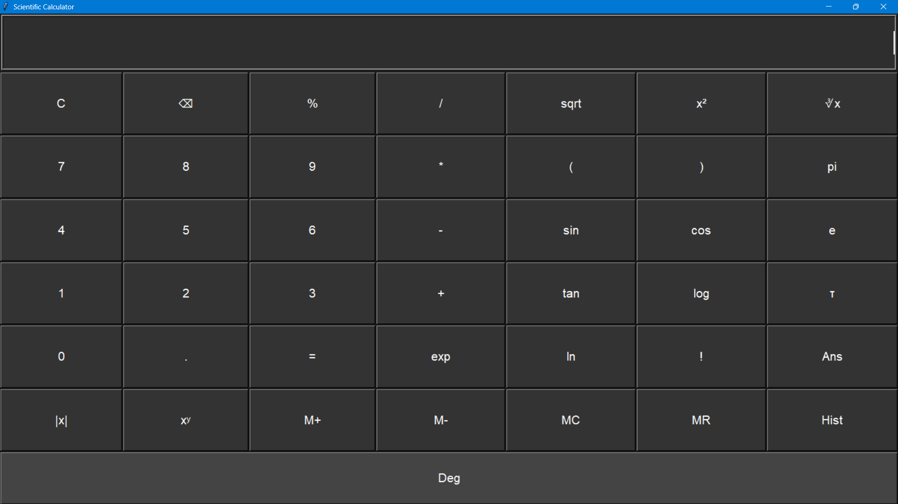

[](https://creativecommons.org/licenses/by-nc-nd/4.0/)

# 🧮 Scientific Calculator using Tkinter

This is a **modern, feature-rich scientific calculator** built using **Python's Tkinter GUI library**. It supports both basic and advanced scientific functions, has memory operations, history tracking, and even supports degree/radian mode switching. The calculator offers a responsive user interface styled with a dark theme for a sleek, modern appearance.



---

## 🎥 Watch Tutorial on YouTube

📺 This project is explained step-by-step in the following YouTube video:  
👉 [Watch on STR Telugu YouTube Channel](https://www.youtube.com/watch?v=YOUR_VIDEO_ID)
[](https://www.youtube.com/watch?v=dQw4w9WgXcQ)

> Don’t forget to Like 👍, Share 🔁, and Subscribe 🔔 to support more free tutorials.

---

## 🚀 Features

- ✅ **Basic Arithmetic**: Addition, subtraction, multiplication, division, modulus.
- 📐 **Scientific Functions**:
  - Trigonometry: `sin`, `cos`, `tan` with **degree/radian toggle**
  - Logarithmic: `log`, `ln`, `exp`
  - Power and roots: `x²`, `∛x`, `xʸ`, `sqrt`
  - Constants: `π`, `e`, `τ`
- 🧠 **Memory Operations**:
  - `M+` – Store current value to memory
  - `M-` – Subtract displayed value from memory
  - `MR` – Recall value from memory
  - `MC` – Clear memory
- 🧾 **History Log**: View all previously calculated expressions and results.
- 🧠 **Ans Button**: Use the result of the last calculation.
- 🎯 **Tooltips**: Hover over any button to view its functionality.
- 💡 **Keyboard Support**: Supports key bindings for numbers, operators, Enter (`=`), and Backspace.

---

## 🛠️ How to Run

### 1. Clone the repository

```bash
git clone https://github.com/yourusername/scientific-calculator.git
cd scientific-calculator
```

---

## 📄 License

This project is licensed under the [Creative Commons BY-NC-ND 4.0 License](https://creativecommons.org/licenses/by-nc-nd/4.0/)

© 2025 Tirupathi Rao Sesapu
Shared for educational purposes via the [STR Telugu](https://www.youtube.com/@STRTelugu) YouTube channel.

This code is:

- ✅ Free to view and learn from.
- ❌ Not allowed to be reused, modified, or distributed.
- ❌ Not allowed for commercial use of any kind.
